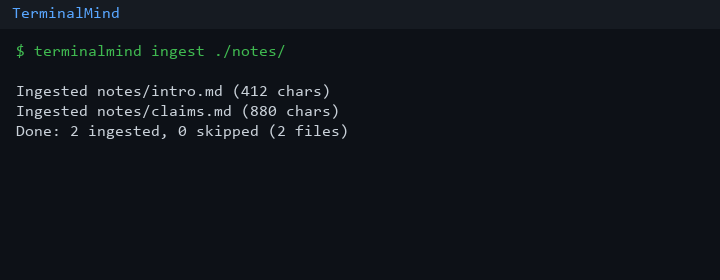

# TerminalMind

Personal Research Assistant CLI for AI Engineering portfolios. Queries an LLM with **strict Structured Outputs** (Pydantic: summary, key points, follow-ups, **sources**), optionally grounds answers in locally ingested `.txt` / `.md` files via keyword RAG-lite, shows chunk citations under each answer, and keeps session history + markdown reports.



## Install

```bash
python -m venv .venv
# Windows Git Bash:
source .venv/Scripts/activate
# Unix:
# source .venv/bin/activate

pip install -e ".[dev]"
cp .env.example .env
```

## Free API (Gemini)

1. Get a free key: https://aistudio.google.com/apikey
2. Put it in `.env` (already templated in `.env.example`):

```env
OPENAI_API_KEY=your-gemini-api-key
OPENAI_BASE_URL=https://generativelanguage.googleapis.com/v1beta/openai/
OPENAI_MODEL=gemini-flash-latest
```

Uses Google’s OpenAI-compatible endpoint — same SDK, no OpenAI billing.

## Usage

```bash
terminalmind ingest ./notes.md
terminalmind ingest ./notes/          # folder: all .txt/.md recursively
terminalmind search "What are the main claims?"
terminalmind chat
terminalmind history
terminalmind history --export out.md
terminalmind --data-dir ./tmp-data search "..."
terminalmind --verbose search "debug run"
```

Flow: **ingest** → **search** / **chat** (structured summary / key points / follow-ups + sources) → **history** / **export**.

`chat` opens an interactive prompt (`you>`) so you can ask many questions without retyping the full command. Type `quit` to leave.

Empty ingest store: search warns and falls back to LLM-only.

## Architecture

Thin Typer CLI → `ResearchAgent` → OpenAI-compatible client (`parse` + JSON-schema fallback) + `Storage` under `~/.terminalmind/` (or `--data-dir`).

Design: `docs/superpowers/specs/2026-07-23-terminalmind-design.md`

## Test

```bash
pytest -v
```

CI runs the same suite on Python 3.11–3.13 via GitHub Actions.

Regenerate the demo GIF (optional): `pip install pillow && python scripts/make_demo_gif.py`
